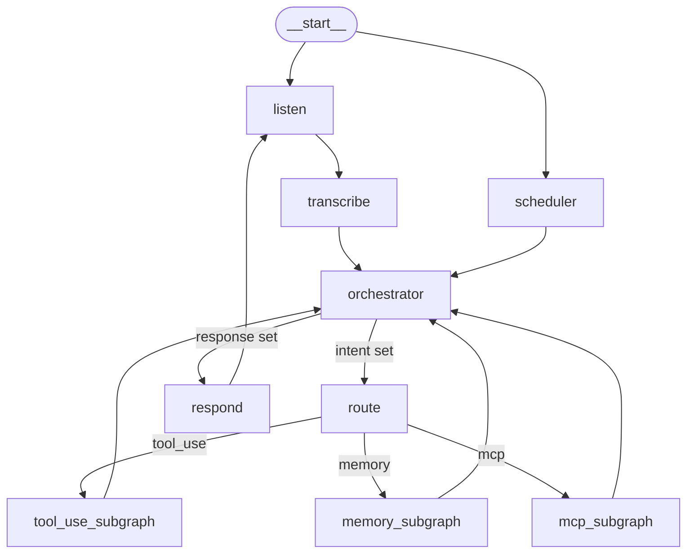

# Renix — System Architecture

> **Status:** Stub — to be completed in step 16 (`docs: full documentation pass`).  
> This document is the single source of truth for the full system. It must be updated in any PR that changes graph structure.

---

## 1. System Diagram

<!-- TODO (step 16): Mermaid diagram of the parent graph — all nodes, edges, conditional branches, subagent boundaries. -->

---

## 2. Reactive Turn Sequence

<!-- TODO (step 16): Sequence diagram from wake word to spoken response. -->

---

## 3. Proactive Turn Sequence

<!-- TODO (step 16): Sequence diagram of scheduler-initiated turn. -->

---

## 4. Node Index

| Node | Role | Doc Section |
|---|---|---|
| `listen` | Blocks on wake word; records audio | [graph.md — listen](modules/graph.md) |
| `transcribe` | Converts audio bytes to transcript text | [graph.md — transcribe](modules/graph.md) |
| `orchestrator` | Sole user-facing LLM node; delegates or responds | [orchestrator.md](modules/orchestrator.md) |
| `route` | Conditional edge; dispatches intent to subagent | [route.md](modules/route.md) |
| `respond` | Passes response to TTS; plays audio | [graph.md — respond](modules/graph.md) |
| `scheduler` | Proactive entry point; sets proactive_message | [scheduler.md](modules/scheduler.md) |

---

## 5. Agent Index

| Subagent | Intent Labels | Doc Section |
|---|---|---|
| `ToolUseAgent` | `tool_use` | [agents.md — ToolUseAgent](modules/agents.md) |
| `MemoryAgent` | `memory` | [agents.md — MemoryAgent](modules/agents.md) |
| `MCPAgent` | `mcp` | [agents.md — MCPAgent](modules/agents.md) |

---

## 6. Extension Guide

### Adding a new subagent

1. Create `modules/agents/my_agent.py` implementing `SubagentPlugin`.
2. Add an instance to `AGENTS` in `modules/agents/__init__.py`.
3. Add the intent label(s) to `INTENT_DISPATCH` in `core/nodes/route.py`.
4. Add a section to `docs/modules/agents.md` with topology diagram and state contract.

No changes to `core/graph.py`, `core/state.py`, or `core/interfaces.py`.

### Adding a new tool

1. Create `modules/tools/builtin/my_tool.py` implementing `ToolPlugin`.
2. Add an instance to `TOOLS` in `modules/tools/__init__.py`.
3. Add a section to `docs/modules/tools.md`.

No other files change.

---

## 7. Security Model

- **Secrets** live exclusively in `.env` (gitignored). Never in `config.yaml` or source code.
- **Audio bytes** (`state["audio_bytes"]`) are ephemeral — cleared by the `transcribe` node before control leaves the node. Never persisted to `MemorySaver`.
- **Transcripts and LLM responses** are not logged at INFO level or above.
- **API keys** are always passed in HTTP headers, never URL parameters.
- **Dependencies** are pinned in `requirements.txt`. Run `pip audit` before deployment.
- To report a vulnerability: open a private GitHub security advisory.
